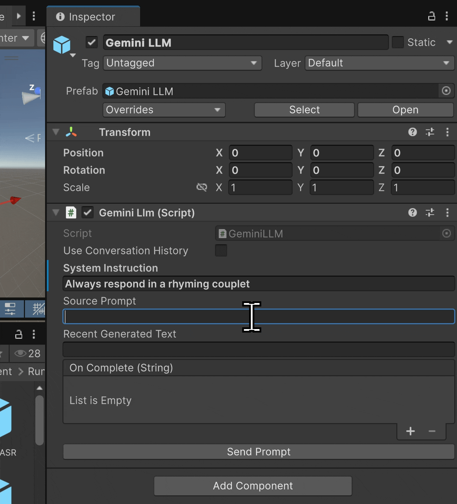
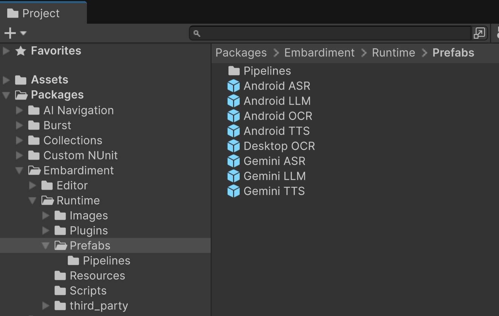

# EmBARDiment: a toolkit for AI Agents in Android XR


## Intro

Embardiment is a user-friendly Unity Package for adding AI functionality to Unity projects, with built native compatibility for Android XR devices.



It provides support the following features and following platforms:

| | Android<br>(incl. Android XR) | Desktop Native | Gemini API<br>(cloud) |
|---:|:---:|:---:|:---:|
| **ASR**<br>Automatic Speech Recognition | ✅ |  | ✅ |
| **LLM**<br>Large Language Model | ✅ |  | ✅ |
| **OCR**<br>Optical Character Recognition | ✅ | ✅ |  |
| **TTS**<br>Text-to-Speech | ✅ |  | ✅ |

These features allow for any research team to build from a full on-device to full on-cloud agents. The matrix of features in this toolkit allows for agents that don't necessarilly need to connect to the cloud, built on top of Gemini Nano and native Android capabilities, this way being privacy preserving for particular academic experiments. And/or much more economic for students to build on class without API keys. The toolkit also allows for high end agents that rely on the latest capabilities of top class AI cloud models like Gemini.

EmBARDiment is an advanced implementation of our IEEE VR'25 paper:
```
Riccardo Bovo, Steve Abreu, Karan Ahuja, Eric J Gonzalez, Li-Te Cheng, Mar Gonzalez-Franco. (2025) 
EmBARDiment: an Embodied AI Agent for Productivity in XR. In 2025 IEEE Conference Virtual Reality and 
3D User Interfaces (IEEE VR ’25), Saint Malo, France. IEEE. https://doi.org/10.1109/VR59515.2025.00093 
```

## Getting Started

### Installation

**Option 1: Example Projects**

The following example boilerplate projects include Embardiment and various project configurations for the following platforms:

* [Android XR](./examples/android-xr)


* [Android Mobile](./examples/andorid-mobile)


* [Desktop](./examples/desktop)


**Option 2: Via Open UPM**

Embardiment is distributed via [OpenUPM](https://openupm.com) and can be installed with the command line:

```
openupm add com.google.xr.embardiment
```


### Package Structure




Embardiment will appear in the Unity project under `Packages/Embardiment/`. Inside this, the most useful things to work with are in `Runtime/Prefabs`.


## Using Embardiment

### Script and Prefab Documentation

Comprehensive technical documentation on all prefabs, scripts, and pipelines is available inside the [references doc](./docs/reference.md).


### Gemini API Key

Cloud Gemini features require an API key.  Embardiment will use the first key it finds in a `Resources` folder.

To add an API key to your project:

1. Create a Resources folder somewhere in your project (for example `Assets/Resources/`)
2. Right click in this folder in Unity and select **Create > Scriptable Objects > Gemini Key**
3. Sign into Google AI Studio: [https://aistudio.google.com/app/apikey](https://aistudio.google.com/app/apikey)
4. Click on "Create API key" and paste it into `Key` of the Gemini Key object you just created in Unity
5. **Ignore your API key from any version control** (e.g. add `GeminiKey.asset` to the end of your .gitignore)


### About Asynchronous Code...

Embardiment relies on services that are external to Unity.  To avoid the problems with stalling, this project does NOT rely on these services synchronously:

```cs
//   ANTIPATTERN
//   Embardiment does NOT work like this...
//   If it did, SendPrompt("Tell me a joke") would freeze Unity until the API was done

GeminiLlm geminiLlm;

string response = geminiLlm.SendPrompt("Tell me a joke");
print(response);

```

Instead, Embardiment calls upon these services asynchronously.  For example, the `GeminiLLM` class has a `UnityEvent` named `OnComplete`.  You can add "listener" functions to `OnComplete` so that anytime `GeminiLLM` responds with a new text generation (via `SendPrompt()`), it will call all associated listener functions.

```cs
GeminiLLM geminiLlm;

void Start() {
    geminiLlm.OnComplete.AddListener(HandleCompletion);
    geminiLlm.SendPrompt("Tell me a joke");
}

// upon SendPrompt completion, `OnComplete` is invoked, which fires this listener
void HandleCompletion(string response) {
    print(response);
}
```

This generic `OnComplete` event is sufficient when you have at most one outstanding API call.  If you have multiple requests out simultaneously, though, this can cause issues:

```cs
GeminiLLM geminiLlm;

void Start() {
    geminiLlm.OnComplete.AddListener(HandleCompletion);

    string[] topics = { "dogs", "cats", "Unity development" };
    foreach (var topic in topics) {
        geminiLlm.SendPrompt($"Tell me one interesting fact about {topic}.");
    }
}

void HandleCompletion(string response) {
    // We can't know which topic this response is for
    print($"Received fact: {response}");
}
```

Embardiment methods provide callback parameters so that you can preserve context:

```cs
GeminiLLM geminiLlm;

void Start() {
    string[] topics = { "dogs", "cats", "Unity development" };

    foreach (var topic in topics) {
        // `topic` is scoped to this loop iteration
        geminiLlm.SendPrompt(
            $"Tell me one interesting fact about {topic}.",
            (response) => {
                print($"Fact about {topic}: {response}");
            }
        );
    }
}

```

## Addenda

### Disclaimer

This is not an officially supported Google product. This project is not eligible for the [Google Open Source Software Vulnerability Rewards Program](https://bughunters.google.com/open-source-security).

### Contributing

We welcome contributions! Please see our [Contributing Guidelines](CONTRIBUTING.md) for more details on how to get involved.

### Authors

 - **Albert Hwang  (Google)** 
 - **Riccardo Bovo (Imperial College London)** - Student Researcher at Google XR 
 - **Eric J Gonzalez (Google)** 
 - **Dwayne Lamb (Magic Leap)** 
 - **Mathias Lystbaek (Aarhus University)** - Student Researcher at Google XR
 - **Karan Ahuja (Google)** 
 - **Li-Te Chen (Google)** 
 - **Andrea Colaco (Google)** 
 - **Mar Gonzalez-Franco (Google)** 
